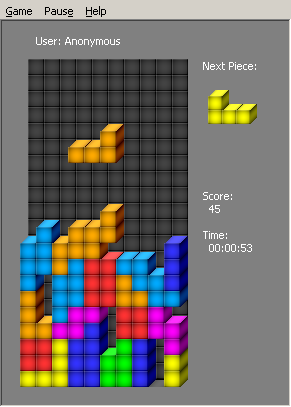

## Tetrisian - a native Win32 Tetris Game

Brought forth are the sources for a Tetris game I wrote in 1999, as-is.

It was written during a time that I've become acquainted with writing
code in C++.

The target platform of this work is Win32 (i.e Windows 95/98/2000),
under the Microsoft Visual C++ environment of that time.

